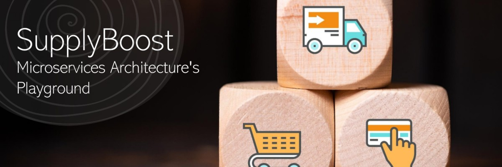

# SupplyBoost


**SupplyBoost** is a supply chain application that aims to bridge the gap between theoretical knowledge and practical implementation. Designed by a software developer, it addresses the common struggle of translating concepts like microservices, event streaming, and cloud technologies into real-world projects. Gone are the days of working on small-scale applications and resorting to outdated methodologies.

## Idea Story
As an aspiring software developer, I'm always reading about new technologies and architectures - microservices, event streaming, crazy cloud stuff. It gets my nerd juices flowing!

But when it comes time to build something in the real-world, I struggle to put all these concepts together. Most projects are too small and I end up hacking things the old-fashioned way.

I know many of you face the same dilemma - you kinda know this tech but haven't really built anything meaningful with it.

So I started SupplyBoost to fix that! It's an ambitious supply chain app that lets me throw every book I've read at it! Microservices, check! Serverless, check! It's a cool playground to go wild!

No more toy apps and todo lists. This is the real deal - a complex beast that helps me level up my skills as an architect and developer. Sure I'll make ton of mistakes on the way, but that's how we learn 💪

In the process, I hope to turn all these buzzwords into practical skills that can be applied to big real-world projects. No more hacky duct tape code!

So come join me on this journey! It's gonna be challenging but oh so rewarding. Let's turn theory into practice. Who's with me? 🚀

## Microservices
To structure projects and improve architecture, separate code repositories are provided for each domains/contexts. It contains:

- [ ] [Shop and eCommerce](https://github.com/saeidamini/eShopOnContainers-Java) : Handles ecommerce frontend and backend
- [ ] [Accounting](https://github.com/saeidamini/accounting-service) : Handles financial and accounting functions like invoicing, payments, and reconciliation.
- [ ] Supply-chain: Handles core supply chain management capabilities
- [ ] Inventory: Manages inventory across the supply chain
- [ ] Order: Handles order management and fulfillment
- [ ] and so on for other domains

# Getting Started

To install this application, run the following commands:

```bash
git clone --recursive  https://github.com/saeidamini/SupplyBoost.git
```
open browser navigate to [http://localhost:8080/](http://localhost:8080/). User and password is same : ``admin``.

Sit back and enjoy the magic! More instructions coming as we build this out.

Have ideas or feedback? File an issue or chat me up on [Twitter](https://twitter.com/saeid_amini). Let's do this together!

## Technologies

Here are the awesome technologies we'll use:

-   Java 17+
-   Spring Boot
-   Spring Cloud (Netflix stack)
-   Docker
-   Kubernetes
-   Kafka
-   Elasticsearch
-   Grafana
-   Vue Storefront
-   [Keycloak](https://www.keycloak.org/)

Microservices, containers, events - we're going all in!

## License

Apache 2.0, see [LICENSE](https://www.apache.org/licenses/LICENSE-2.0).
