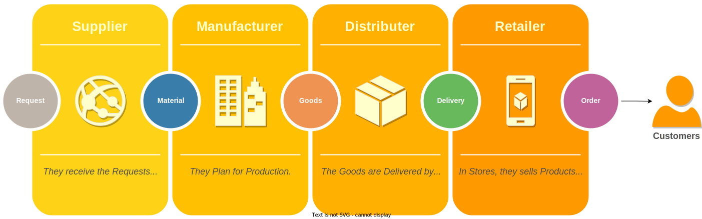

# SupplyBoost

SupplyBoost is a supply chain management application with Gateway and five microservice applications. This uses eureka for service discovery and JWT authentication.

## SupplyBoost's modules

SupplyBoost have these modules:
- **Supply**
    - They receive the requests and send them to the factories (use by Supplier).
- **Manufacture**
    - They Plan for Production (use by Manufacture).
- **Distribute**
    - The Goods are Delivered by the Retailer (use by Distributor).
- **Retail**
    - In Stores, they sales Goods to Customer (use by Retailer).
- **Notification**
  - Send all type of notification(SMS, Email, ...) in other modules.

## Main Workflow
SupplyBoost have many workflow that run by users. 

### Buy Products from Retailer

Customer view products on the Retail site and create ProductOrder for buying. If the Retailer has products in Stock,  
create an Invoice for the Delivery Company. Workflow has been finished when delivered products to Customer.

**Hint: Each node have 4 parts.** 
  - Action
  - Entity 
  - Module (Microservice)
  - Description

## Technical Stack

SupplyBoost use the following open source libraries:

* [Spring Boot](https://spring.io/projects/spring-boot)
* [Spring Cloud](https://spring.io/projects/spring-cloud)
* [Spring Cloud Gateway](https://spring.io/projects/spring-cloud-gateway)
* [Spring Security](https://spring.io/projects/spring-security)
* [Consul](https://github.com/hashicorp/consul)
* [Hazelcast](https://hazelcast.com/)
* [Maven](https://maven.apache.org/)
* [Java 11+ : OpenJDK](https://openjdk.java.net/)
* [Docker](https://www.docker.com)

## License

Apache 2.0, see [LICENSE](LICENSE).
